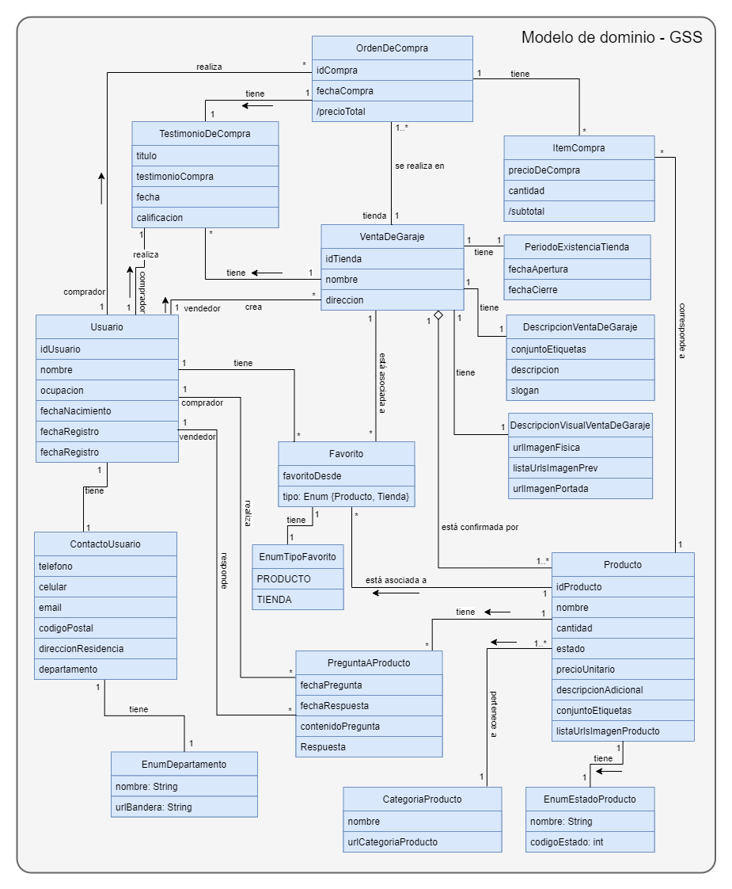
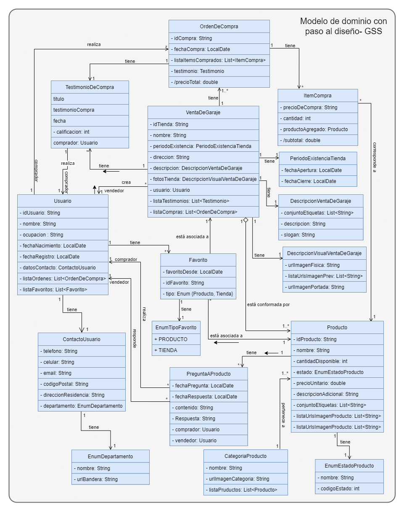

# Proyecto para el curso: Análisis y Diseño de Sistemas II

## Universidad de Antioquia - Seccional Oriente

---

### Estudiante:

- Juan Camilo Cardona Calderón

---

### Diagramas

Modelo de dominio: https://drive.google.com/file/d/1ZBntb_fUIdpbHjRNFpVeu--grCadvhXV/view?usp=sharing

Diagramas UML de la aplicación:

Mockups de todas las vistas: https://drive.google.com/file/d/1fC02VW5KYMVq9UWNFGcZtf0ENdChzACl/view?usp=sharing

Aplicación desplegada en firebase: https://garage-sale-store.web.app/

---

### Modelo de dominio

---

### Modelo de dominio con paso al diseño

